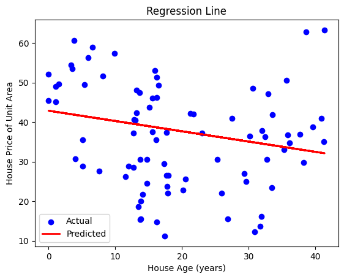
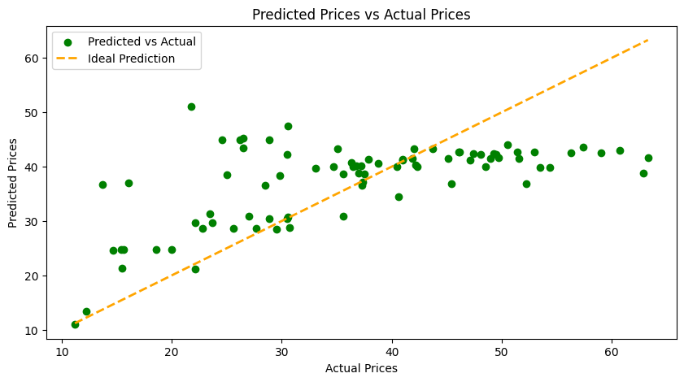

# 🧠 PriceScope: Predicting Real Estate Values 🎉

Welcome to **PriceScope: Predicting Real Estate Values**—a project that leverages Simple Linear Regression to predict real estate prices based on various features, such as house age, proximity to MRT stations, and convenience stores. This project uses historical market data from Taipei, Taiwan, and aims to demonstrate the effectiveness of regression modeling in real estate valuation.

## 📚 Table of Contents

1. [Overview](#overview)
2. [Dataset](#dataset)
3. [Google Colab Setup](#google-colab-setup)
4. [Usage](#usage)
5. [Implementation Details](#implementation-details)
6. [Results](#results)
7. [Contributing](#contributing)
8. [Acknowledgements](#acknowledgements)

## 🏫 Overview

The goal of PriceScope is to predict the price per unit area of a property using various independent features. The key features considered are house age, distance to MRT stations, number of nearby convenience stores, and geographic coordinates. The project applies a simple linear regression model to determine which features have the most significant impact on property prices.

## 📊 Dataset

The dataset used is the **Real Estate Valuation Dataset** from the UCI Machine Learning Repository, containing historical property information from Sindian Dist., New Taipei City, Taiwan. Key columns include:
- House age (years)
- Distance to nearest MRT station (meters)
- Number of convenience stores nearby
- Geographic coordinates (latitude and longitude)
- Price of unit area (target variable)

## 🚀 Google Colab Setup

Steps to set up your project in Google Colab:

1. **Open the Colab Notebook**:
   - Create a new notebook in Google Colab.

2. **Clone the Repository**:
   ```python
   !git clone https://github.com/yourusername/PriceScope.git
   ```

3. **Install Required Libraries**:
   ```python
   !pip install -r PriceScope/requirements.txt
   ```

## 🎉 Usage

To use the project:
- Clone the GitHub repository in Google Colab.
- Run the notebook cells sequentially to train and evaluate the model.
- Ensure you have the dataset in the appropriate folder or download it using the link provided.

## ✨ Implementation Details

The project involves the following steps:
- Data preprocessing: Loading, cleaning, and splitting the dataset.
- Model training: Implementing Simple Linear Regression using `scikit-learn`.
- Evaluation: Calculating metrics like Mean Squared Error (MSE) and R² score to evaluate model performance.

## 🎨 Results

The project demonstrates the relationship between property prices and various features through regression analysis, providing key visualizations to illustrate findings.
#### a. Regression Line
[](Regression_line.png)  
*Figure 1: Regression line plotted against actual prices, illustrating the model's fit to the data.*

#### b. Predicted vs. Actual Prices
[](Predicted_vs_Actual Price.png)  
*Figure 2: Scatter plot showing predicted prices versus actual prices, highlighting the model's predictive power.*

## 🤝 Contributing

Contributions are welcome! If you'd like to improve the model, add new features, or optimize the code, please feel free to fork the repository and submit a pull request.

## 🎉 Acknowledgements

Credit goes to the UCI Machine Learning Repository for providing the dataset and to the contributors of the `scikit-learn` library for making machine learning accessible.

---

### Project Structure

```
PriceScope/
├── README.md
├── requirements.txt
├── dataset/
│   └── real_estate.csv (if applicable)
├── PriceScope.ipynb
└── images/ (for any visual outputs)
```

### requirements.txt

```
numpy
pandas
matplotlib
scikit-learn
```

### Final Tips

- Ensure your code is clean and well-commented.
- Test your notebook in Google Colab to confirm everything works as expected.
- Keep your GitHub repo updated with any improvements.

By following this format, you'll create a well-organized and user-friendly GitHub project, ready for Google Colab!
