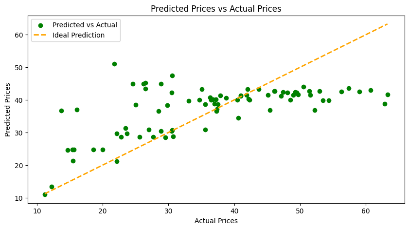

## 🎨 Results

The model performance and visualizations produced during the analysis are crucial for understanding the effectiveness of the linear regression model. Below are the key results from the project:

### 1. Performance Metrics
The performance of the linear regression model on the test dataset was evaluated using the following metrics:

- **Mean Squared Error (MSE)**: 165.205
- **R² Score**: 0.015

These metrics indicate that while the model provides some predictive ability, there is significant room for improvement.

### 2. Visualizations
Key visualizations generated during the analysis include:

#### a. Regression Line
  
*Figure 1: Regression line plotted against actual prices, illustrating the model's fit to the data.*

#### b. Predicted vs. Actual Prices
  
*Figure 2: Scatter plot showing predicted prices versus actual prices, highlighting the model's predictive power.*

### 3. Feature Comparison
The model was also trained using different features to identify the most influential one for predicting house prices:

- **R² Score for Distance to Nearest MRT Station (X3)**: 0.539
- **R² Score for Number of Convenience Stores (X4)**: 0.394
- **R² Score for Latitude (X5)**: 0.355
- **R² Score for Longitude (X6)**: 0.385

From the results, **the distance to the nearest MRT station (X3)** emerged as the most significant feature for predicting the house price of unit area.
